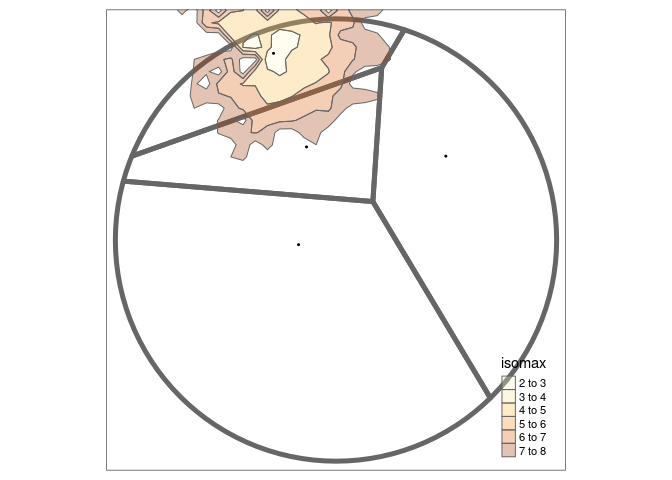

# Voronoiesque polygons based on travel times isochrones

# Pre-requisites

The code underlying this paper requires R to be installed.

# Input data

The input datasets for the example data are as follows:

- Street network in a 1 km buffer around central Oldenburg
- 4 pubs in Oldenburg

# Voronoi polygons

# Isochrones

    Simple feature collection with 4 features and 3 fields
    Geometry type: MULTIPOLYGON
    Dimension:     XY
    Bounding box:  xmin: 8.203783 ymin: 53.14221 xmax: 8.218292 ymax: 53.15138
    Geodetic CRS:  WGS 84
    # A tibble: 4 × 4
         id isomin isomax                                                   geometry
      <int>  <dbl>  <dbl>                                         <MULTIPOLYGON [°]>
    1     1      0      2 (((8.211609 53.14746, 8.210783 53.14753, 8.210232 53.1473…
    2     2      2      4 (((8.209544 53.14879, 8.209131 53.14888, 8.208895 53.1487…
    3     3      4      6 (((8.209131 53.14983, 8.208305 53.15013, 8.208187 53.1497…
    4     4      6      8 (((8.208305 53.15138, 8.208114 53.15127, 8.207479 53.1509…

