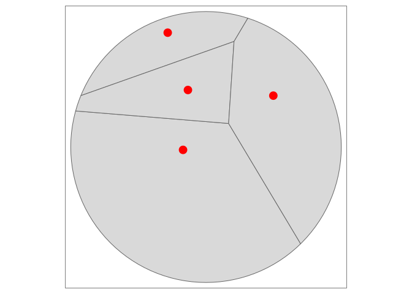

# Voronoiesque polygons based on travel times isochrones

# Pre-requisites

The code underlying this paper requires R to be installed.

# Input data

The input datasets for the example data are as follows:

- Street network in a 1 km buffer around central Oldenburg
- 4 points in Oldenburg


# Voronoi polygons



# Isochrones

    Simple feature collection with 4 features and 3 fields
    Geometry type: MULTIPOLYGON
    Dimension:     XY
    Bounding box:  xmin: 8.203783 ymin: 53.14221 xmax: 8.218292 ymax: 53.15138
    Geodetic CRS:  WGS 84
    # A tibble: 4 × 4
         id isomin isomax                                                   geometry
      <int>  <dbl>  <dbl>                                         <MULTIPOLYGON [°]>
    1     1      0      2 (((8.211609 53.14746, 8.210783 53.14753, 8.210232 53.1473…
    2     2      2      4 (((8.209544 53.14879, 8.209131 53.14888, 8.208895 53.1487…
    3     3      4      6 (((8.209131 53.14983, 8.208305 53.15013, 8.208187 53.1497…
    4     4      6      8 (((8.208305 53.15138, 8.208114 53.15127, 8.207479 53.1509…


# Next steps with isochrone polygon intersection approach

The example above demonstrates the calculation of voronoi polygons and
isochrone polygons associated with points. To get from this example to
catchment areas associated with travel times, building on the approach
of calculating multiple isochrones, a number of problems need to be
solved:

- Iterative union of isochrone polygons associated with each point for
  which there are no ‘collissions’
- In cases where there are ‘collisions’ between isochrone polygons,
  erase polygons with larger travel times with polygons associated with
  a different point that have lower travel times
- Where isochrone polygons of equal travel time intersect, find the
  centreline of the intersection and partition polygons according, as
  outlined
  [here](https://gis.stackexchange.com/questions/217151/how-to-align-edges-of-overlapping-polygons-in-the-middle-line)

# Alternative approaches

Another approach would be to iteratively sample points located between
points to find locations that have roughly equal travel times. From
these ‘equal travel time points’ polygons can be constructed.

# Nearest hex cells


We’ll iterate over every hex cell to find the nearest pub, first using
nearest distances:


Next, we’ll use travel times to find the nearest pub. To minimise the
number of requests, the strategy will be as follows: we will identify
hex cells that touch the boundary between two or more territories.

``` r
inner_lines = rmapshaper::ms_innerlines(voronoi_hex)
voronoi_hex_boundary = hex_joined[inner_lines, ]
tm_shape(voronoi_hex, bb = st_bbox(voronoi)) + tm_polygons(col = "name") +
  tm_shape(voronoi_hex_boundary) + tm_fill(col = "grey", alpha = 0.8) +
  tm_shape(points) + tm_dots(col = "red", size = 0.8) +
  tm_shape(voronoi) + tm_borders(col = "blue", lwd = 5) +
  tm_layout(legend.outside = TRUE)
```


We’ll prepare the OSM network for routing.

# Routing with sfnetworks

``` r
net_linestrings = sf::st_cast(walking_network, "LINESTRING")
net_groups = stplanr::rnet_group(net_linestrings)
largest_group = table(net_groups) |> which.max()
net_clean = net_linestrings[net_groups == largest_group, ]
net_sfn = sfnetworks::as_sfnetwork(net_clean, directed = FALSE)
net_igraph = igraph::as.igraph(net_sfn)
net_sf = net_sfn |> 
  sfnetworks::activate("edges") |> 
  dplyr::mutate(from, to, TRAVEL_COST = units::drop_units(sfnetworks::edge_length())) |> 
  sf::st_as_sf() |> 
  dplyr::select(from, to, TRAVEL_COST)
```

# Routing with cppRouting


      from  to      dist
    1    0  76  63.02741
    2    1 364 383.60190
    3    2  85  14.04821
    4    3 710  18.22150
    5    4  34  27.57053
    6    5 712  67.35609

      ref id
    1   1  0
    2   3  1
    3   5  2
    4   7  3
    5   9  4
    6  11  5

    List of 5
     $ data  :'data.frame': 1695 obs. of  3 variables:
      ..$ from: int [1:1695] 0 1 2 3 4 5 6 7 8 9 ...
      ..$ to  : int [1:1695] 76 364 85 710 34 712 1206 925 253 1265 ...
      ..$ dist: num [1:1695] 63 383.6 14 18.2 27.6 ...
     $ coords: NULL
     $ nbnode: int 2190
     $ dict  :'data.frame': 2190 obs. of  2 variables:
      ..$ ref: chr [1:2190] "1" "3" "5" "7" ...
      ..$ id : int [1:2190] 0 1 2 3 4 5 6 7 8 9 ...
     $ attrib:List of 4
      ..$ aux  : NULL
      ..$ cap  : NULL
      ..$ alpha: NULL
      ..$ beta : NULL

    List of 1
     $ 1244_113: chr(0) 
