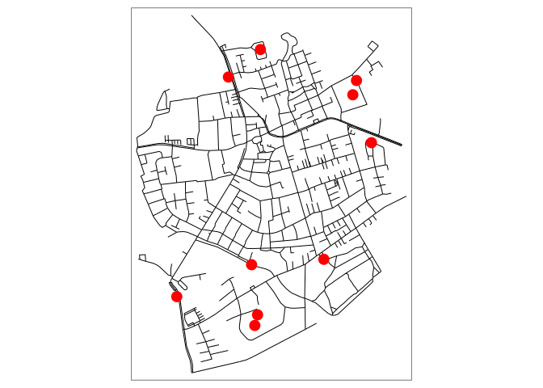
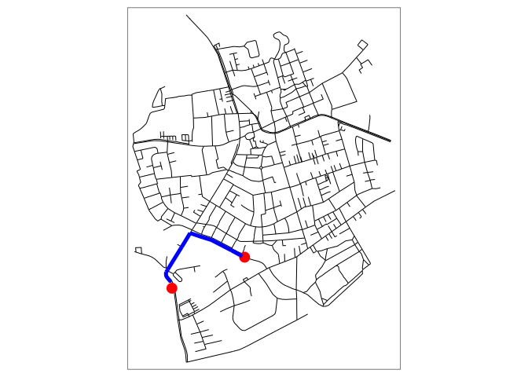

# Voronoiesque polygons based on travel times isochrones

# Pre-requisites

The code underlying this paper requires R to be installed.

# Input data

The input datasets for the example data are as follows:

- Street network in a 1 km buffer around central Oldenburg
- 4 points in Oldenburg


# Voronoi polygons


# Isochrones

    Simple feature collection with 4 features and 3 fields
    Geometry type: MULTIPOLYGON
    Dimension:     XY
    Bounding box:  xmin: 8.203783 ymin: 53.14221 xmax: 8.218292 ymax: 53.15138
    Geodetic CRS:  WGS 84
    # A tibble: 4 × 4
         id isomin isomax                                                   geometry
      <int>  <dbl>  <dbl>                                         <MULTIPOLYGON [°]>
    1     1      0      2 (((8.211609 53.14746, 8.210783 53.14753, 8.210232 53.1473…
    2     2      2      4 (((8.209544 53.14879, 8.209131 53.14888, 8.208895 53.1487…
    3     3      4      6 (((8.209131 53.14983, 8.208305 53.15013, 8.208187 53.1497…
    4     4      6      8 (((8.208305 53.15138, 8.208114 53.15127, 8.207479 53.1509…


# Next steps with isochrone polygon intersection approach

The example above demonstrates the calculation of voronoi polygons and
isochrone polygons associated with points. To get from this example to
catchment areas associated with travel times, building on the approach
of calculating multiple isochrones, a number of problems need to be
solved:

- Iterative union of isochrone polygons associated with each point for
  which there are no ‘collissions’
- In cases where there are ‘collisions’ between isochrone polygons,
  erase polygons with larger travel times with polygons associated with
  a different point that have lower travel times
- Where isochrone polygons of equal travel time intersect, find the
  centreline of the intersection and partition polygons according, as
  outlined
  [here](https://gis.stackexchange.com/questions/217151/how-to-align-edges-of-overlapping-polygons-in-the-middle-line)

# Alternative approaches

Another approach would be to iteratively sample points located between
points to find locations that have roughly equal travel times. From
these ‘equal travel time points’ polygons can be constructed.

# Nearest hex cells


We’ll iterate over every hex cell to find the nearest pub, first using
nearest distances:


Next, we’ll use travel times to find the nearest pub. To minimise the
number of requests, the strategy will be as follows: we will identify
hex cells that touch the boundary between two or more territories.

``` r
inner_lines = rmapshaper::ms_innerlines(voronoi_hex)
hex_boundary = hex_joined[inner_lines, ]
hex_boundary_centroids = st_centroid(hex_boundary)
tm_shape(voronoi_hex, bb = st_bbox(voronoi)) + tm_polygons(col = "name") +
  tm_shape(hex_boundary) + tm_fill(col = "grey", alpha = 0.8) +
  tm_shape(points) + tm_dots(col = "red", size = 0.8) +
  tm_shape(voronoi) + tm_borders(col = "blue", lwd = 5) +
  tm_layout(legend.outside = TRUE)
```


We’ll prepare the OSM network for routing.

# Routing with sfnetworks

We’ll start by demonstrating how the package works with the sample
dataset.

    Simple feature collection with 851 features and 2 fields
    Geometry type: LINESTRING
    Dimension:     XY
    Bounding box:  xmin: 7.522594 ymin: 51.94151 xmax: 7.546705 ymax: 51.9612
    Geodetic CRS:  WGS 84
    # A tibble: 851 × 3
       name                  type                                           geometry
     * <chr>                 <fct>                                  <LINESTRING [°]>
     1 Havixbecker Strasse   residential      (7.533722 51.95556, 7.533461 51.95576)
     2 Pienersallee          secondary   (7.532442 51.95422, 7.53236 51.95377, 7.53…
     3 Schulte-Bernd-Strasse residential (7.532709 51.95209, 7.532823 51.95239, 7.5…
     4 <NA>                  path        (7.540063 51.94468, 7.539696 51.94479, 7.5…
     5 Welsingheide          residential       (7.537673 51.9475, 7.537614 51.94562)
     6 <NA>                  footway     (7.543791 51.94733, 7.54369 51.94686, 7.54…
     7 <NA>                  footway           (7.54012 51.94478, 7.539931 51.94514)
     8 <NA>                  path        (7.53822 51.94546, 7.538131 51.94549, 7.53…
     9 <NA>                  track       (7.540063 51.94468, 7.540338 51.94468, 7.5…
    10 <NA>                  track       (7.5424 51.94599, 7.54205 51.94629, 7.5419…
    # ℹ 841 more rows



We’ll calculate the route from point 1 to point 2:



We can calculate many routes as follows:

    [1] "tbl_df"     "tbl"        "data.frame"

    Simple feature collection with 9 features and 6 fields
    Geometry type: LINESTRING
    Dimension:     XY
    Bounding box:  xmin: 7.525638 ymin: 51.94607 xmax: 7.53265 ymax: 51.94883
    Geodetic CRS:  WGS 84
    # A tibble: 9 × 7
       from    to name         type                     geometry weight route_number
      <int> <int> <chr>        <fct>            <LINESTRING [°]>    [m]        <int>
    1    67    68 <NA>         path    (7.527863 51.94883, 7.52… 282.              1
    2    68   181 <NA>         path    (7.531646 51.94785, 7.53…  62.4             1
    3   181   195 <NA>         path    (7.532444 51.94758, 7.53…  15.9             1
    4   439   440 Pienersallee second… (7.525749 51.94671, 7.52…  12.1             1
    5    67   194 Pienersallee second… (7.527863 51.94883, 7.52… 102.              1
    6   440   565 Pienersallee second… (7.525659 51.94662, 7.52…  15.4             1
    7   565   667 Pienersallee second… (7.52564 51.94648, 7.525…  54.8             1
    8   194   646 Pienersallee second… (7.527087 51.94805, 7.52… 165.              1
    9   439   646 Pienersallee second… (7.525816 51.94679, 7.52…   9.45            1


We can calculate the amount of travel on each link as follows:


``` r
net_linestrings = sf::st_cast(walking_network, "LINESTRING")
net = sfnetworks::as_sfnetwork(net_linestrings, directed = FALSE)
library(tidygraph)
with_graph(net, graph_component_count())
```

    [1] 623

``` r
net = net |>
  activate("edges") |>
  mutate(weight = edge_length()) |>
  activate("nodes") |>
  filter(group_components() == 1)
with_graph(net, graph_component_count())
```

    [1] 1

``` r
net_sf = net |> 
  sfnetworks::activate("edges") |> 
  sf::st_as_sf() |> 
  dplyr::select(from, to, weight)
nrow(net_sf)
```

    [1] 763

``` r
nrow(walking_network)
```

    [1] 1732

``` r
tm_shape(walking_network) + tm_lines("grey", lwd = 5) +
  tm_shape(net_sf) + tm_lines("blue", lwd = 2) 
```


We’ll start by calculating routes from the first `hex_boundary` cell to
the nearest point.


    $tm_layout
    $tm_layout$legend.outside
    [1] TRUE

    $tm_layout$style
    [1] NA


    attr(,"class")
    [1] "tm"

## Calculation of shortest paths in boundary cell

A logical next step is to calculate the shortest path to n nearest (in
Euclidean distance) destinations for ‘boundary cells’. We do this for
the first boundary cell as follows:


Next we’ll calculate the paths, keeping the total length of each path:

    1182.469 [m]

    [1] "Gaststätte zum Pferdemarkt"

    [1] "Big Ben Pub"

As shown, the pub associated with the shortest path is different from
the pub associated with the original cell. We will update the cell value
to reflect this:

    [1] "Gaststätte zum Pferdemarkt"


We’ll now repeat this process for all boundary cells:


# Routing with cppRouting

# Next steps

- Debug the results of the `sfnetworks` approach
- Get the `cppRouting` approach working
- Improve networks used for routing with network cleaning approaches
